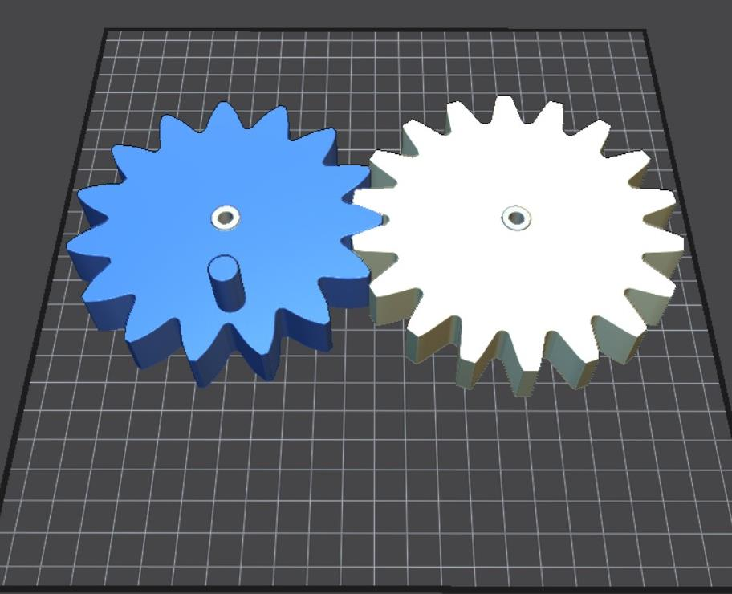
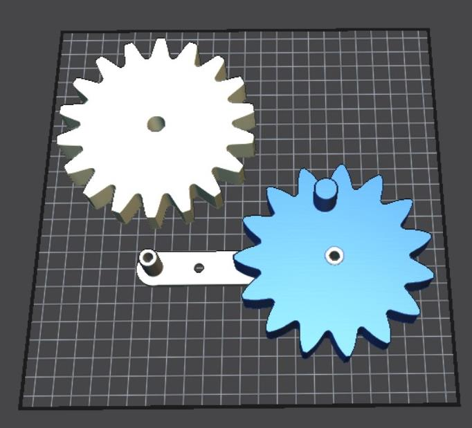
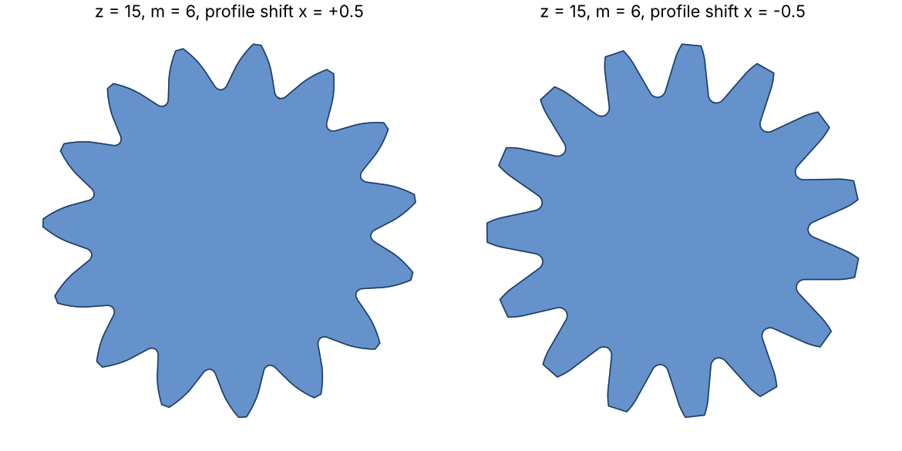
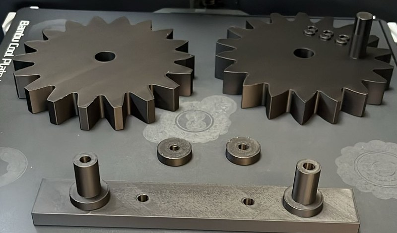
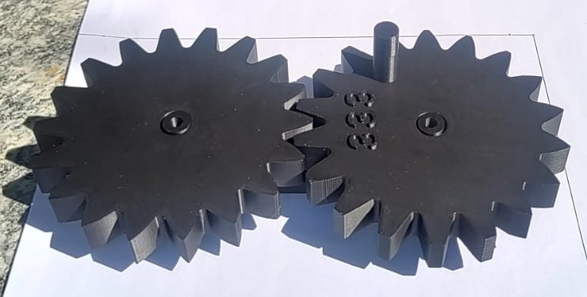

# Parametric Involute Gear with Profile Shift (Lua · IceSL)


A fully parametric Lua script that generates a meshing **involute gear pair with profile shift**, plus shaft pins and a stand, ready for 3D printing. Change the number of teeth, module, pressure angle or profile shift in IceSL's *Tweaks* panel and the geometry updates live. Export as STL or G-code.

<p align="center">
  
  
</p>

## What it does

- **Builds tooth geometry from first principles.** Involute flanks from the base circle, root fillets, tip/root diameters and centre distance, all corrected for profile shift `x`.
- **Writes its own mesh.** A custom `extrude()` turns the 2D profile into a 3D polyhedron (vertices + triangles), with optional twist and scaling along the extrusion.
- **Outputs a complete assembly.** Two gears with shaft holes and a handle, assembly pins and a connecting stand, placed at the correct centre distance.
- **Tested in CI.** A small IceSL stand-in lets the geometry run headless in plain Lua. GitHub Actions checks the profile on every push (closed contour, no NaN points, tip-diameter and centre-distance formulas).

<p align="center">
  
</p>

## Printed result

Printed in PLA on a Bambu Lab printer with the default parameters: both gears, the two pins and the stand fresh off the build plate (left), and the gear pair meshing after assembly (right).

<p align="center">
  
  
</p>

## Parameters

| Parameter | Default | Meaning |
|---|---|---|
| `z1`, `z2` | 15, 18 | Number of teeth, gear 1 / gear 2 |
| `m` | 6 mm | Module (both gears) |
| `alpha` | 20° | Pressure angle |
| `h_a_coefficient` / `h_f_coefficient` | 1.0 / 1.25 | Addendum / dedendum height factor |
| `x1`, `x2` | +0.5, −0.5 | Profile shift coefficients |
| `rho_f_p` | 0.38 | Root fillet radius coefficient |
| `Face_width`, `handle_height` | 20 mm | Gear thickness, handle height |
| `c_2_c_tolerance` | 0 | Extra centre-distance clearance (× m) |

Key relations used: `d_a = m·z + 2m(h_a + x)`, `d_f = m·z − 2m(h_f − x)`, `a = m(z1+z2)/2 + (x1+x2)·m`.

## Run it

1. Install [IceSL](https://icesl.loria.fr) (free, Windows/Linux).
2. Open `involute_gear_profile_shift.lua`. The model appears and the *Tweaks* panel shows the parameters.
3. Adjust parameters, then slice and export STL / G-code (see the [user guide](docs/User_Guide.pdf), section 7).

Run the tests without IceSL:

```bash
lua tests/test_gear.lua
```

## Repository layout

```
involute_gear_profile_shift.lua   main IceSL script
tests/icesl_stub.lua              minimal IceSL API stand-in for headless runs
tests/test_gear.lua               geometry checks (run in CI)
docs/User_Guide.pdf               14-page user guide (functions, slicing, assembly)
.github/workflows/test.yml        GitHub Actions pipeline
```

## Background

Case study *Cyber-Physical Production Systems using Additive Manufacturing*, Technische Hochschule Deggendorf, 2024.
Team (Group 17): Bennet Kurian, Sarath Satheesh, Sajin Saji · Advisor: Prof. Dr.-Ing. Stefan Scherbarth.

The final assembly block (creating the two gear solids and their placement) was rebuilt from the user guide. It is marked in the script.
